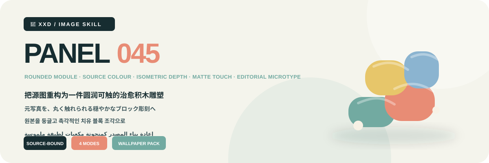

<p align="center"></p>

<div align="center">

# 🦁 XXD Panel 045

### Rebuild the source as a gentle tactile block sculpture

[](./SKILL.md)
[](#)
[](#)

<a href="README.md">简体中文</a> · <strong>English</strong> · <a href="README.ja.md">日本語</a> · <a href="README.ko.md">한국어</a> · <a href="README.ar.md">العربية</a>

</div>

<div>

> ROUNDED MODULE · SOURCE COLOUR · ISOMETRIC DEPTH · MATTE TOUCH · EDITORIAL MICROTYPE

Distinctive volume, axes, curves, interlocks, overlaps, occlusions, and negative spaces become rounded tactile modules in a gentle isometric sculpture, coloured only from the source's own visual memory.

## Why this Skill exists

The style is source-dependent, not a decorative preset. Its operative transformation is:

```text
analyse volume, axis, curves, overlap, and negative space → preserve three defining cues → simplify into rounded modular masses → compose through stacking, nesting, crossing, suspension, and source-earned misalignment → translate source colour into lighter cleaner healing hierarchy → render tactile matte pulp, wood, wax, or soft material → integrate microtype with seams and axes
```

If an unrelated photograph could replace the source without materially changing recognition, construction, placement, material, colour, whitespace, and copy, the result does not belong to this Panel.

## The visual contract

- Preserve at least three cues across overall volume, proportion, axis, curve, pose, direction, overlap, occlusion, opening, negative space, or relation.
- Use rounded, simple, tactile modular masses with real isometric depth. Stack, join, nest, cross, float, or gently misalign them according to source structure, not mechanical exploded parts.
- Analyse the source's lively principal colours, temperature, value hierarchy, warm-cool response, and key accent; translate them into lighter, cleaner, airy healing colour without importing absent hues or a fixed palette.
- Build rhythm through principal colour area, supporting layers, related value steps, and one tiny lively accent: gentle but energetic, playful but not sugary.
- Use matte diffuse tactile material suggesting paper pulp, wood, soft wax, chalk, or flexible composite, with rounded edges and light shadows; reject glossy plastic, metal, heavy CG, and cheap toys.
- Use scale, height, depth, local suspension, density shifts, and whitespace to create one sculptural focus rather than a full toy scene.

Complete aesthetic constraints and rejection rules live in the Skill and production prompts. They preserve the original brief without turning its historical 3:4 canvas into a hidden default. [SKILL.md](SKILL.md) · [production prompt](references/xxd-panel-045-prompt.en.md)

## Samples · Coming soon

Only finished work verified by the project owner will be added to `assets/examples/`; another style is never used as a placeholder.

## Four combinable output modes

Choose one or several modes with `1`, `1+3`, `1,2,4`, or `all`. `all` produces seven PNGs per source: three ordinary outputs plus four wallpapers.

| Mode | Default sizing | Result |
| --- | --- | --- |
| `top-bottom` | source-adaptive `W×2H` | full source above and transformed design below, exact 50/50 |
| `left-right` | source-adaptive `2W×H` | full source left and transformed design right, exact 50/50 |
| `design-only` | source-adaptive `W×H` | transformed design only, no visible source |
| `wallpaper-pack` | labelled device sizes | separate phone, iPad, desktop, and children's-watch PNGs |

Wallpapers may be linked or independent. A linked set approves one anchor, then every device references the original plus that same anchor; it never crops or chains derivatives. An independent set gives every device only the original source.

## Copy and locale

Automatic copy, exact custom copy, or text-free output is confirmed before generation. Copy follows the intended audience rather than the command language, and exact user wording remains verbatim.

Project-specific copy rule: Use one two-to-five-word source-bound title plus only useful state, place, supplied number, direction word, or micro-note; do not use years. Align native microtype with module edges, seams, axes, negative space, overlaps, or occlusion so it becomes part of the sculpture's rhythm.

## Geometry, raster output, and trust

Ordinary canvases adapt to the source unless overridden. Paired layouts are exact 50/50; all deliverables are raster PNGs. Every invocation creates a fresh task under `~/Desktop/xxd/`, and private route details are never exposed.

The configured bitmap bridge emits sanitised status only. It never exposes providers, endpoints, credentials, headers, prompts, responses, or account details. SVG, HTML, Canvas, diagrams, and programmatic art are not substitutes for final raster artwork.

## Get started

```bash
git clone https://github.com/nevertoday/xxd-panel-045.git
mkdir -p ~/.codex/skills
ln -s "$(pwd)/xxd-panel-045" ~/.codex/skills/xxd-panel-045
```

Claude Code users may link the same folder under `~/.claude/skills/xxd-panel-045`. Restart the agent session after installation.

```text
$xxd-panel-045
Use this photograph, ask me for the modes and copy setting, then generate fresh raster outputs.
```

Full specifications: [Skill workflow](SKILL.md) · [source archive](references/045-source.md) · [English prompt](references/xxd-panel-045-prompt.en.md) · [Chinese prompt](references/xxd-panel-045-prompt.zh-CN.md)

## About XXD

XXD is Xiaoxiaodong's abbreviated brand name. Created and maintained by [@xiaoxiaodong01](https://x.com/xiaoxiaodong01).

## Support and membership

### In-depth consultation · CNY 299/hour

One-to-one in-depth consultation for using Skills. Contact Xiaoxiaodong through WeChat. [WeChat](https://xiaoxiaodong.pages.dev/assets/wechat-qr.png)

### Xiaoxiaodong Skills User Community · CNY 99

A one-time fee joins the Skills user community for workflow sharing and peer discussion; hourly consultation is separate.

### Knowledge Planet + Member Prompt Library · CNY 699/year

One annual payment opens both Knowledge Planet and the member prompt library. Join either side, then contact Xiaoxiaodong on WeChat for the other access.

[Knowledge Planet](https://wx.zsxq.com/group/15554814142882) · [Member Prompt Library](https://vip.xiaoxiaodong.ai/)

<p align="center"><a href="https://xiaoxiaodong.pages.dev/assets/wechat-qr.png"></a></p>

<div align="center"><strong>Softness does not erase structure; it lets structure become approachable.</strong></div>

---

<div align="center">

## Support this open-source project

Chinese-language support may use Xiaoxiaodong's own WeChat or Alipay reward codes; other editions use Buy Me a Coffee. Support is optional and never changes access to the open-source project.


<p align="center"><a href="https://github.com/nevertoday/zhongguo-traditional-colors/blob/main/docs/images/buy-me-a-coffee-qr.png?raw=true"></a></p>

</div>
</div>
